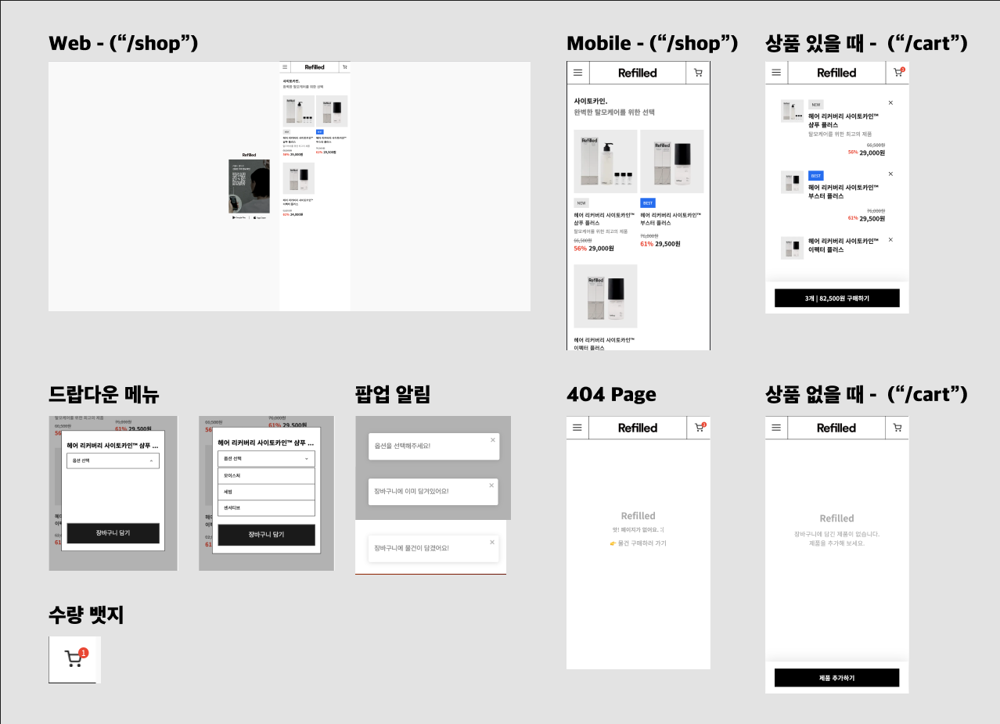

# Refilled Free Assginment

✔️사전 과제 진행 시 중요사항 꼭 읽어보세요!

Next.js를 사용해주셔야 합니다. 버전은 11이상이면 됩니다 :) <br/>
SCSS를 사용해주셔야 합니다.<br/>
font는 전부 Noto Sans KR로 통일합니다. 그 외 css는 디자인과 동일하게 진행해주세요.<br/>
redux / redux-toolkit / react-query 중 최소 1개를 사용해주셔야 합니다.<br/>
코드는 본인 github에 반드시 public으로 설정하셔서 올려주셔야 합니다.<br/>
branch는 다음과 같이 사용해주세요.<br/>
main : 개발이 완료되면 main으로 PR을 날려주세요! (main으로 바로 합치지 말아주세요.)<br/>
feature/test : 해당 브랜치에서 개발을 진행해주시고 push해주세요!<br/>
즉, 레포에 main, feature/test 이렇게 2개의 브랜치가 있으면 됩니다.<br/>
타인의 도움을 받거나, 타인의 코드를 복사할 경우 불합격 처리가 됩니다.<br/>

---

## 실행방법

```js
// Dev 모드
yarn dev

or

// Product 모드
yarn build && yarn start
```

---

## 사용 스택

1. Next.js - Page Directory (with 13버전)

- 13버전으로 업데이트 되면서 page router 방식에서 app router 및 app dir으로 변경되고 RSC의 적극적인 활용이나 폴더-파일으로 구성된 기존의 라우팅 방식이 폴더 단위로 바뀐 점, 렌더링 방식이 페이지에서 컴포넌트로 바뀐 점 등 12버전과 많은 부분에서 달라졌습니다. <br/><br/> 이런 변화된 기술들은 13버전을 사용할 이유가 되기도 하지만, 실제 프로덕트라면 어떻게 개발이 진행될까 하고 고민을 했습니다. 그 결과, 새로운 스택을 도입하는 것보다 (현 시간 기준 실제 상용화된 프로덕트라면) 기존의 기술을 토대로 새로운 기능들을 도입할 것 같다고 생각되어 버전은 13버전으로 하되, 기존 12버전의 체계인 page dir를 활용했습니다.

2. redux-toolkit

- 클라이언트 상에서의 데이터를 전역관리하기 위해 redux-toolkit을 활용했습니다.

  - 모달 on/off를 위한 state 관리
  - 제품 카드 클릭 시 해당 상품 데이터 저장을 위한 state 관리
  - 장바구니 수량 업데이트를 위한 state 관리

---

## 필수 외 추가 사용 라이브러리

1. react-toastify

- 알림 팝업을 위한 toastify 라이브러리

2. react-icons

- 아이콘 활용을 위한 라이브러리

3. axios

- 데이터 페칭을 위한 라이브러리

---

### 스택 요구 사항

- [x] Next.js 사용
- [x] SCSS 사용
- [x] Redux-toolkit 활용

---

### 기본 요구 사항

- [x] API를 통해 데이터를 받아와 물품 리스트 렌더링
- [x] 상품 클릭 시 옵션 선택 창 노출
  > 제시된 UI에 맞추어 드랍다운 메뉴로 구현<br/>
  > 클릭 시 active 속성을 활용해 구분감 추가
- [x] 장바구니 기능 구현
  > 피그마 상 수량 구현이 없어 id값을 비교하여 중복 상품이 등록되는 것을 방지하는 형태로 구현 <br/>
- [x] 375px 초과 및 375px 이하 반응형 구현

---

### 추가 기능 고려 사항

- [x] 장바구니 갯수 뱃지
- [x] 옵션 미선택 시 알림 팝업
- [x] 장바구니 담기 시 알림 팝업
- [x] 장바구니에 담겨있는 물품 담기 시 이미 담겨있음을 알리는 팝업(중복 상품 추가 막기)

---

## 동작 예시


## 캡쳐


